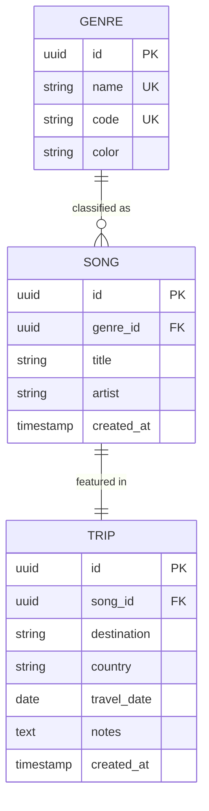

# Melody Trip - 간소화 ERD (3시간 MVP)

## 1. 데이터베이스 개요

### 1.1 핵심 유지 사항

이 ERD는 **음악과 여행의 연결**이라는 핵심을 유지하면서 3시간 내 구현 가능하도록 간소화했습니다.

**유지된 핵심**:
- ✅ 여행 기록 (trips)
- ✅ 음악 정보 (songs)
- ✅ 음악 장르 (genres)
- ✅ trips ↔ songs 관계

**제거된 복잡성**:
- ❌ 사용자 인증 (users 테이블)
- ❌ 위치 상세 정보 (locations, regions 테이블)
- ❌ 사진 (photos 테이블)
- ❌ 감정 태그 (emotion_tags 테이블)
- ❌ 챗봇 히스토리 (chat_recommendations 테이블)

---

## 2. 엔티티-관계 다이어그램

### 2.1 Mermaid ERD



### 2.2 관계 설명

- **GENRE (1) → SONG (N)**: 하나의 장르는 여러 곡을 가질 수 있음
- **SONG (1) → TRIP (1)**: 하나의 곡은 하나의 여행에 연결됨
  - 주의: 같은 곡을 여러 여행에서 재사용할 수도 있지만, 간소화를 위해 매번 새로 생성

---

## 3. 테이블 정의

### 3.1 GENRE (음악 장르 - 마스터 데이터)

#### 스키마

| 컬럼명 | 타입 | 제약조건 | 설명 |
|--------|------|---------|------|
| **id** | uuid | PK, NOT NULL | 장르 ID |
| **name** | text | UNIQUE, NOT NULL | 장르명 (한글) |
| **code** | text | UNIQUE, NOT NULL | 장르 코드 (영문) |
| **color** | text | NOT NULL | 장르별 색상 (HEX) |

#### SQL 정의

```sql
CREATE TABLE genres (
    id UUID PRIMARY KEY DEFAULT gen_random_uuid(),
    name TEXT UNIQUE NOT NULL,
    code TEXT UNIQUE NOT NULL,
    color TEXT NOT NULL
);

-- 초기 데이터 삽입
INSERT INTO genres (name, code, color) VALUES
    ('팝', 'pop', '#FF6B6B'),
    ('인디', 'indie', '#4ECDC4'),
    ('클래식', 'classical', '#9B59B6'),
    ('록', 'rock', '#F39C12'),
    ('재즈', 'jazz', '#27AE60'),
    ('힙합', 'hiphop', '#2C3E50'),
    ('기타', 'other', '#95A5A6');

CREATE INDEX idx_genres_code ON genres(code);
```

**주의사항**:
- 마스터 데이터로 앱 시작 시 미리 삽입
- 사용자가 직접 추가/수정 불가

---

### 3.2 SONG (음악 정보)

#### 스키마

| 컬럼명 | 타입 | 제약조건 | 설명 |
|--------|------|---------|------|
| **id** | uuid | PK, NOT NULL | 음악 ID |
| **genre_id** | uuid | FK, NOT NULL | 장르 ID (GENRE 참조) |
| **title** | text | NOT NULL | 곡명 |
| **artist** | text | NOT NULL | 아티스트명 |
| **created_at** | timestamp | NOT NULL, DEFAULT NOW() | 생성 시간 |

#### SQL 정의

```sql
CREATE TABLE songs (
    id UUID PRIMARY KEY DEFAULT gen_random_uuid(),
    genre_id UUID NOT NULL REFERENCES genres(id) ON DELETE RESTRICT,
    title TEXT NOT NULL,
    artist TEXT NOT NULL,
    created_at TIMESTAMP NOT NULL DEFAULT NOW()
);

CREATE INDEX idx_songs_genre_id ON songs(genre_id);
CREATE INDEX idx_songs_created_at ON songs(created_at DESC);
```

**주의사항**:
- Spotify API 없이 사용자가 수동 입력
- 중복 방지 없음 (간소화)
- 같은 곡도 매번 새로 생성 가능

---

### 3.3 TRIP (여행 기록)

#### 스키마

| 컬럼명 | 타입 | 제약조건 | 설명 |
|--------|------|---------|------|
| **id** | uuid | PK, NOT NULL | 여행 ID |
| **song_id** | uuid | FK, NOT NULL | 음악 ID (SONG 참조) |
| **destination** | text | NOT NULL | 여행지명 |
| **country** | text | NOT NULL | 국가명 |
| **continent** | text | NOT NULL | 대륙 (아시아, 유럽, 북미, 남미, 아프리카, 오세아니아) |
| **travel_category** | text | NOT NULL | 여행 카테고리 (도시, 자연, 해변, 문화, 모험, 휴양) |
| **travel_date** | date | NOT NULL | 여행 날짜 |
| **latitude** | numeric(10,8) | | 위도 (세계 지도용) |
| **longitude** | numeric(11,8) | | 경도 (세계 지도용) |
| **notes** | text | | 메모 |
| **created_at** | timestamp | NOT NULL, DEFAULT NOW() | 기록 생성 시간 |

#### SQL 정의

```sql
CREATE TABLE trips (
    id UUID PRIMARY KEY DEFAULT gen_random_uuid(),
    song_id UUID NOT NULL REFERENCES songs(id) ON DELETE RESTRICT,
    destination TEXT NOT NULL,
    country TEXT NOT NULL,
    continent TEXT NOT NULL,
    travel_category TEXT NOT NULL,
    travel_date DATE NOT NULL,
    latitude NUMERIC(10, 8),
    longitude NUMERIC(11, 8),
    notes TEXT,
    created_at TIMESTAMP NOT NULL DEFAULT NOW()
);

CREATE INDEX idx_trips_song_id ON trips(song_id);
CREATE INDEX idx_trips_travel_date ON trips(travel_date DESC);
CREATE INDEX idx_trips_created_at ON trips(created_at DESC);
CREATE INDEX idx_trips_coordinates ON trips(latitude, longitude);
CREATE INDEX idx_trips_continent ON trips(continent);
CREATE INDEX idx_trips_category ON trips(travel_category);
```

**주의사항**:
- song_id는 필수 (음악 없는 여행 기록 불가)
- latitude, longitude는 선택사항 (세계 지도 표시용)

---

## 4. 관계 정의

### 4.1 GENRE (1) → SONG (N)

```sql
-- 외래키
FOREIGN KEY (genre_id) REFERENCES genres(id) ON DELETE RESTRICT

-- 삭제 정책: RESTRICT
-- 장르 삭제 불가 (곡이 참조 중)

-- 쿼리 예: 특정 장르의 모든 곡 조회
SELECT * FROM songs WHERE genre_id = $1;
```

### 4.2 SONG (1) → TRIP (1)

```sql
-- 외래키
FOREIGN KEY (song_id) REFERENCES songs(id) ON DELETE RESTRICT

-- 삭제 정책: RESTRICT
-- 음악 삭제 불가 (여행이 참조 중)

-- 쿼리 예: 여행과 함께 음악 정보 조회
SELECT
    t.*,
    s.title,
    s.artist,
    g.name as genre_name,
    g.color as genre_color
FROM trips t
JOIN songs s ON t.song_id = s.id
JOIN genres g ON s.genre_id = g.id
WHERE t.id = $1;
```

---

## 5. 주요 쿼리

### 5.1 여행 + 음악 조회 (JOIN)

```sql
-- 전체 여행 목록 (음악 정보 포함)
SELECT
    t.id,
    t.destination,
    t.country,
    t.travel_date,
    t.notes,
    s.id as song_id,
    s.title as song_title,
    s.artist as song_artist,
    g.name as genre_name,
    g.color as genre_color
FROM trips t
JOIN songs s ON t.song_id = s.id
JOIN genres g ON s.genre_id = g.id
ORDER BY t.created_at DESC;
```

### 5.2 장르별 통계

```sql
-- 장르별 여행 횟수
SELECT
    g.id,
    g.name,
    g.color,
    COUNT(t.id) as trip_count
FROM genres g
LEFT JOIN songs s ON g.id = s.genre_id
LEFT JOIN trips t ON s.id = t.song_id
GROUP BY g.id, g.name, g.color
ORDER BY trip_count DESC;
```

### 5.3 대륙별 통계

```sql
-- 대륙별 여행 횟수
SELECT
    continent,
    COUNT(*) as trip_count,
    COUNT(DISTINCT country) as country_count
FROM trips
GROUP BY continent
ORDER BY trip_count DESC;

-- 대륙별 + 장르 통계
SELECT
    t.continent,
    g.name as genre_name,
    g.color as genre_color,
    COUNT(t.id) as trip_count
FROM trips t
JOIN songs s ON t.song_id = s.id
JOIN genres g ON s.genre_id = g.id
GROUP BY t.continent, g.name, g.color
ORDER BY t.continent, trip_count DESC;
```

### 5.4 카테고리별 통계

```sql
-- 여행 카테고리별 횟수
SELECT
    travel_category,
    COUNT(*) as trip_count
FROM trips
GROUP BY travel_category
ORDER BY trip_count DESC;

-- 카테고리별 + 장르 통계
SELECT
    t.travel_category,
    g.name as genre_name,
    g.color as genre_color,
    COUNT(t.id) as trip_count
FROM trips t
JOIN songs s ON t.song_id = s.id
JOIN genres g ON s.genre_id = g.id
GROUP BY t.travel_category, g.name, g.color
ORDER BY t.travel_category, trip_count DESC;
```

### 5.5 기본 통계

```sql
-- 총 여행 횟수
SELECT COUNT(*) as total_trips FROM trips;

-- 방문한 국가 수
SELECT COUNT(DISTINCT country) as total_countries FROM trips;

-- 저장된 음악 수
SELECT COUNT(*) as total_songs FROM songs;

-- 가장 많이 사용한 장르
SELECT
    g.name,
    COUNT(t.id) as count
FROM genres g
LEFT JOIN songs s ON g.id = s.genre_id
LEFT JOIN trips t ON s.id = t.song_id
GROUP BY g.name
ORDER BY count DESC
LIMIT 1;
```

---

## 6. Supabase 설정

### 6.1 테이블 생성 스크립트 (전체)

```sql
-- 1. genres 테이블
CREATE TABLE genres (
    id UUID PRIMARY KEY DEFAULT gen_random_uuid(),
    name TEXT UNIQUE NOT NULL,
    code TEXT UNIQUE NOT NULL,
    color TEXT NOT NULL
);

CREATE INDEX idx_genres_code ON genres(code);

-- 2. genres 마스터 데이터
INSERT INTO genres (name, code, color) VALUES
    ('팝', 'pop', '#FF6B6B'),
    ('인디', 'indie', '#4ECDC4'),
    ('클래식', 'classical', '#9B59B6'),
    ('록', 'rock', '#F39C12'),
    ('재즈', 'jazz', '#27AE60'),
    ('힙합', 'hiphop', '#2C3E50'),
    ('기타', 'other', '#95A5A6');

-- 3. songs 테이블
CREATE TABLE songs (
    id UUID PRIMARY KEY DEFAULT gen_random_uuid(),
    genre_id UUID NOT NULL REFERENCES genres(id) ON DELETE RESTRICT,
    title TEXT NOT NULL,
    artist TEXT NOT NULL,
    created_at TIMESTAMP NOT NULL DEFAULT NOW()
);

CREATE INDEX idx_songs_genre_id ON songs(genre_id);
CREATE INDEX idx_songs_created_at ON songs(created_at DESC);

-- 4. trips 테이블
CREATE TABLE trips (
    id UUID PRIMARY KEY DEFAULT gen_random_uuid(),
    song_id UUID NOT NULL REFERENCES songs(id) ON DELETE RESTRICT,
    destination TEXT NOT NULL,
    country TEXT NOT NULL,
    continent TEXT NOT NULL,
    travel_category TEXT NOT NULL,
    travel_date DATE NOT NULL,
    latitude NUMERIC(10, 8),
    longitude NUMERIC(11, 8),
    notes TEXT,
    created_at TIMESTAMP NOT NULL DEFAULT NOW()
);

CREATE INDEX idx_trips_song_id ON trips(song_id);
CREATE INDEX idx_trips_travel_date ON trips(travel_date DESC);
CREATE INDEX idx_trips_created_at ON trips(created_at DESC);
CREATE INDEX idx_trips_coordinates ON trips(latitude, longitude);
CREATE INDEX idx_trips_continent ON trips(continent);
CREATE INDEX idx_trips_category ON trips(travel_category);
```

### 6.2 RLS 비활성화 (간소화 버전)

```sql
-- 로그인 없으므로 RLS 비활성화
ALTER TABLE genres DISABLE ROW LEVEL SECURITY;
ALTER TABLE songs DISABLE ROW LEVEL SECURITY;
ALTER TABLE trips DISABLE ROW LEVEL SECURITY;
```

---

## 7. API 사용 예시 (Supabase JavaScript)

### 7.1 여행 + 음악 조회

```javascript
// 전체 여행 조회 (JOIN)
const { data: trips, error } = await supabase
  .from('trips')
  .select(`
    *,
    song:songs (
      id,
      title,
      artist,
      genre:genres (
        name,
        color
      )
    )
  `)
  .order('created_at', { ascending: false })

// 결과 예시
// trips = [
//   {
//     id: '...',
//     destination: 'Paris',
//     country: 'France',
//     travel_date: '2024-06-15',
//     notes: '...',
//     song: {
//       id: '...',
//       title: 'La vie en rose',
//       artist: 'Édith Piaf',
//       genre: {
//         name: '클래식',
//         color: '#9B59B6'
//       }
//     }
//   }
// ]
```

### 7.2 여행 + 음악 생성

```javascript
// 1단계: 음악 먼저 생성
const { data: song, error: songError } = await supabase
  .from('songs')
  .insert([{
    title: 'La vie en rose',
    artist: 'Édith Piaf',
    genre_id: 'genre-uuid-for-classical'
  }])
  .select()
  .single()

if (songError) throw songError

// 2단계: 여행 생성
const { data: trip, error: tripError } = await supabase
  .from('trips')
  .insert([{
    destination: 'Paris',
    country: 'France',
    travel_date: '2024-06-15',
    song_id: song.id,
    notes: '로맨틱한 여행이었어요'
  }])
  .select()
  .single()

if (tripError) throw tripError
```

### 7.3 장르별 통계 조회

```javascript
// Supabase에서 직접 GROUP BY는 제한적이므로
// 클라이언트에서 처리

const { data: trips } = await supabase
  .from('trips')
  .select(`
    song:songs (
      genre:genres (
        name,
        color
      )
    )
  `)

// JavaScript에서 그룹화
const genreStats = trips.reduce((acc, trip) => {
  const genreName = trip.song.genre.name
  const genreColor = trip.song.genre.color

  if (!acc[genreName]) {
    acc[genreName] = { name: genreName, color: genreColor, count: 0 }
  }
  acc[genreName].count++

  return acc
}, {})

// 결과: { '인디': { name: '인디', color: '#4ECDC4', count: 5 }, ... }
```

---

## 8. 샘플 데이터

### 8.1 테스트용 샘플 데이터

```sql
-- genres는 이미 삽입됨

-- songs 샘플
INSERT INTO songs (genre_id, title, artist) VALUES
    ((SELECT id FROM genres WHERE code = 'classical'), 'La vie en rose', 'Édith Piaf'),
    ((SELECT id FROM genres WHERE code = 'indie'), 'Plastic Love', '竹内まりや'),
    ((SELECT id FROM genres WHERE code = 'jazz'), 'Fly Me to the Moon', 'Frank Sinatra'),
    ((SELECT id FROM genres WHERE code = 'pop'), 'Shape of You', 'Ed Sheeran'),
    ((SELECT id FROM genres WHERE code = 'rock'), 'Bohemian Rhapsody', 'Queen');

-- trips 샘플 (좌표, 대륙, 카테고리 포함)
INSERT INTO trips (song_id, destination, country, continent, travel_category, travel_date, latitude, longitude, notes) VALUES
    ((SELECT id FROM songs WHERE title = 'La vie en rose'), 'Paris', 'France', '유럽', '문화', '2024-06-15', 48.8566, 2.3522, '에펠탑과 루브르 박물관을 방문했습니다.'),
    ((SELECT id FROM songs WHERE title = 'Plastic Love'), 'Tokyo', 'Japan', '아시아', '도시', '2024-05-20', 35.6762, 139.6503, '신주쿠와 아키하바라를 둘러봤어요.'),
    ((SELECT id FROM songs WHERE title = 'Fly Me to the Moon'), 'New York', 'USA', '북미', '도시', '2024-04-10', 40.7128, -74.0060, '재즈 바에서 음악을 들으며 즐거운 시간을 보냈습니다.'),
    ((SELECT id FROM songs WHERE title = 'Shape of You'), 'London', 'UK', '유럽', '도시', '2024-03-05', 51.5074, -0.1278, '활기찬 런던의 밤 거리를 걸었어요.'),
    ((SELECT id FROM songs WHERE title = 'Bohemian Rhapsody'), 'Barcelona', 'Spain', '유럽', '문화', '2024-02-15', 41.3851, 2.1734, '사그라다 파밀리아가 인상적이었습니다.');
```

---

## 9. 인덱스 전략

### 9.1 인덱스 목록

| 테이블 | 인덱스명 | 컬럼 | 용도 |
|--------|---------|------|------|
| genres | idx_genres_code | code | 장르 코드 조회 |
| songs | idx_songs_genre_id | genre_id | 장르별 음악 조회 |
| songs | idx_songs_created_at | created_at DESC | 최신 음악 조회 |
| trips | idx_trips_song_id | song_id | 음악별 여행 조회 |
| trips | idx_trips_travel_date | travel_date DESC | 날짜순 정렬 |
| trips | idx_trips_created_at | created_at DESC | 최신순 정렬 |
| trips | idx_trips_coordinates | latitude, longitude | 지도 마커 렌더링 |
| trips | idx_trips_continent | continent | 대륙별 통계 조회 |
| trips | idx_trips_category | travel_category | 카테고리별 통계 조회 |

### 9.2 성능 최적화

```sql
-- ✅ 좋은 쿼리: 인덱스 활용
SELECT * FROM trips
ORDER BY created_at DESC
LIMIT 10;
-- idx_trips_created_at 사용

-- ✅ 좋은 쿼리: JOIN + 인덱스
SELECT t.*, s.*, g.*
FROM trips t
JOIN songs s ON t.song_id = s.id
JOIN genres g ON s.genre_id = g.id
ORDER BY t.created_at DESC;
-- idx_trips_created_at, idx_trips_song_id, idx_songs_genre_id 사용
```

---

## 10. 마이그레이션 체크리스트

```
□ Supabase 프로젝트 생성
□ genres 테이블 생성
□ genres 마스터 데이터 7개 삽입 확인
□ songs 테이블 생성
□ trips 테이블 생성 (continent, travel_category 컬럼 포함)
□ 외래키 관계 확인 (genres → songs, songs → trips)
□ 인덱스 8개 생성 확인 (continent, category 인덱스 포함)
□ RLS 비활성화 (또는 전체 허용 정책)
□ 샘플 데이터 삽입 (선택사항)
□ Supabase API 키 확인
□ 환경 변수 설정 (.env.local)
```

---

## 11. 데이터 크기 예측

### 11.1 예상 크기 (1년 후)

```
genres: 7행 (고정)
songs: 50-100행
trips: 50-100행

총 크기: < 100KB (충분히 작음)
```

---

## 12. 마무리

이 간소화된 ERD는 **3개 테이블**로 구성됩니다.

**테이블**:
- ✅ genres (음악 장르 - 마스터)
- ✅ songs (음악 정보)
- ✅ trips (여행 기록)

**관계**:
- ✅ genres (1) → songs (N)
- ✅ songs (1) → trips (1)

**핵심 유지**:
- ✅ 음악과 여행의 연결
- ✅ 장르별 분류
- ✅ JOIN 쿼리로 음악 정보 함께 조회

**구현 소요 시간**:
- Supabase 설정: 10분
- 테이블 생성: 10분
- 총: **20분**

Good luck! 🎵✈️
